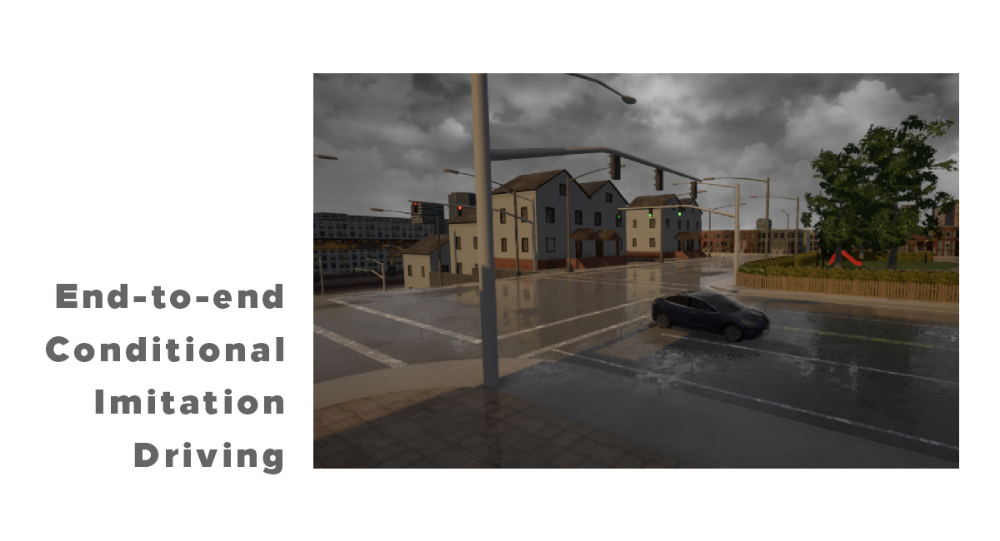

# End-to-end Conditional Imitation Driving 
Autonomous driving research (Part I)




The purpose of this project is to create system that is able to collect data and prepare dataset, just as training neural network for end-to-end imitation learning for autonomous driving, in purpose of research of the autonomous driving concepts. 

The system is created for Carla simulator. 


## Video

The link of the video shows short demo of results, brief overview of purpose of data augmentation, and comparison of two models in specific situations: one trained on raw data, and second trained on data on which augmentation was applied. 

https://www.youtube.com/watch?v=LoXPs6NShLI

## Usage

### Packages

```
Python: 3.7.4
Carla simulator: 0.9.8
Keras: 2.2.4
Tensorflow: 1.14.0
Imgaug: 0.4.0
OpenCV: 3.4.7
```

## Steps

The whole process of collecting data which ends with training neural network is divided in several steps: 

1. __Collecting data ```colecting_data.py```:__  
Collecting data is consisted of taking a picture from an automobile’s camera with appropriate steering angle which is put on the list. Collected data is kept in batches with 256 samples. During collecting data, Carla autopilot controls an automobile. The data is possible to collect during multiple sessions.

2. __Overview of collected data ```show_colected_data.py```:__  
Overview of raw data through all batches of one session. 

3. __Adding high-level control to data ```add_high_level_control.py```:__  
After collecting data, it is necessary to add the high-level control information, that is to say, the adding of the information which led the automobile to corresponding action. At the beginning we are choosing the sessions which we want to go through with adding high-level control. High-level control is added by selecting the start frame on the ‘O’ button on the keyboard from which a corresponding high-level control is valid. The ‘P’ button on the keyboard selects the end frame up to which the control was valid, after which we select specific control (information). After going through all batches of all sessions, the program saves the file with all high-level controls of all sessions. 

4. __Creating dataset for training ```data_to_dataset.py```:__  
After defining high-level controls for all data which we want to use foe training, it is required to create dataset for training, which should consist of suitable distribution of data. The data also mixes, and batches are created of 256 samples for training in the form X^j={images, high-level control}, Y^j={steering angle}, where j defines number of batches.


5. __Architecture of model ```functional_conditional_end_to_end_keras_model.py```:__  
The base of the architecture which was used is shown in End-to-End Learning for Self-Driving Cars (https://arxiv.org/pdf/1604.07316.pdf), with certain changes which have to do with one more input which have to do with high-level control. 


6. __Model training ```train_model_batches_control.py```:__  
Model training is done in batches gained from last step. This method is chosen so that data augmentation is done in easy and fast way, and to solve memory issues. 

7. __Model testing ```test_model_in_CARLA.py```:__  
In the process of the model testing is necessary to choose model that we want to test, and city in Carla simulator in which we want to test model. Arrows on the keyboard are the commands for giving high-level control information. 


## Models

With code there are two models: one trained on the raw data, and the other trained on the data on which data augmentation was applied. 

Both models are trained through 10 epochs, on relatively small dataset with approximately 190000 frames divided in 745 batches. For optimizations algorithm Adam with learning rate of 1e-4 was used. 

__It is important to underline that raw data is collected in sunny environment, without clouds and rain. The data augmentation is very noticeable in changed environment with clouds and rain, where the model trained on the raw data does not manage well, and where model trained on the same data, but with augmentation manage is better.__


